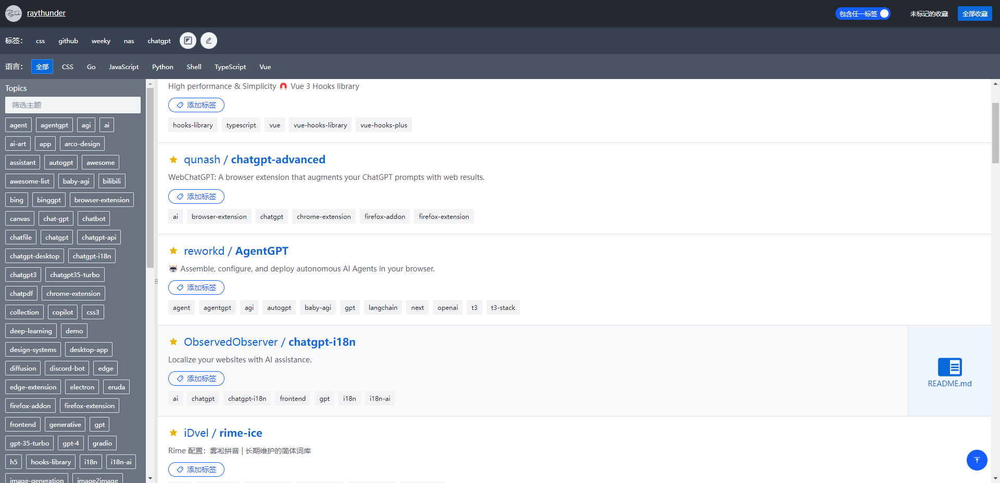
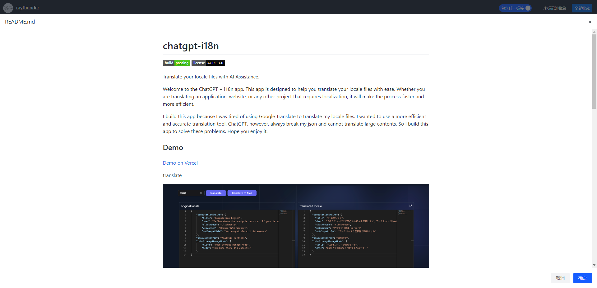
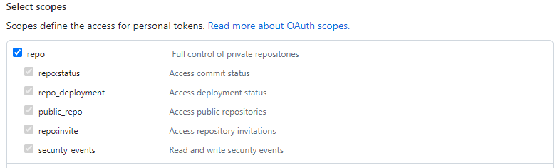
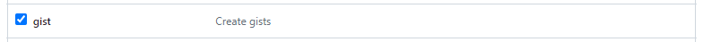

English | [中文](README-CN.md)

# Github stars manager

This is a web tool designed to manage your GitHub stars. It uses tags to organize and categorize your starred repositories. All data is saved in your own GitHub Gists.

## [Demo](https://github-stars-manager-7oxg.vercel.app/#/dashboard)

The preview of the README.md file matches the official format.

# Get your personal access token

Get access token from [Here](https://github.com/settings/tokens)

If you need to use it for an extended period of time, choose 'No expiration' for the expiration time.

# Star loader from here

https://codepen.io/slyka85/pen/QvBQPb
